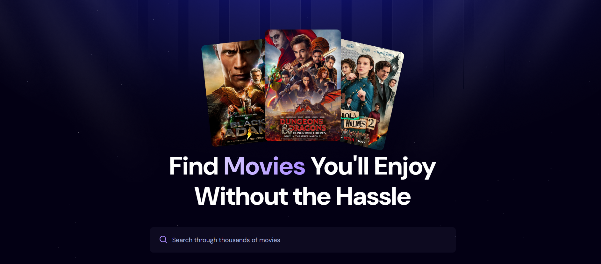
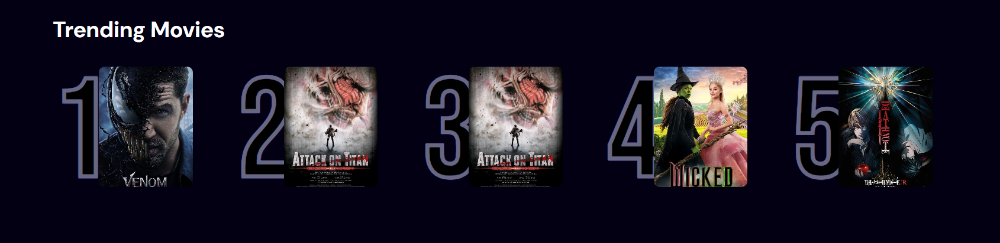
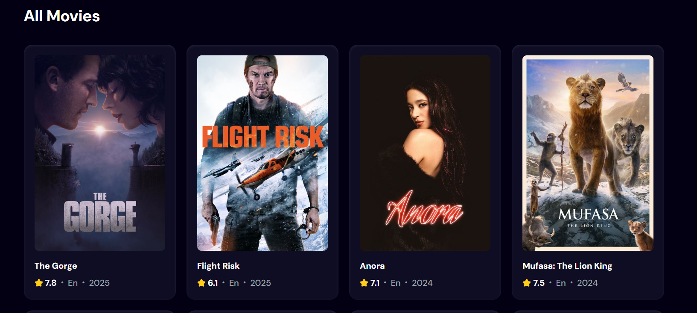

# 🎬 Movie App with React & TMDB API

## 📌 Overview
This is a **Movie App** built with **React**, leveraging the **TMDB API** to fetch movie data. The app provides users with an intuitive interface to:

- 🔍 **Search for movies** by title
- ⭐ **View movie ratings** and details
- 📈 Explore a **Popular Movies section** featuring trending movies
- 📊 Store and track **most searched movies** using **Appwrite** as the backend & database

## 🚀 Features
- **Movie Search**: Instantly search for any movie using TMDB API.
- **Movie Details**: View details, ratings, and posters.
- **Trending Movies**: See what's popular based on search trends.
- **Backend Integration**: Uses **Appwrite** to store and track most searched movies.

## 🛠 Tech Stack
- **Frontend:** React
- **API:** TMDB
- **Backend & Database:** Appwrite

## 📸 Screenshots




## 🔧 Installation
### 1️⃣ Clone the repository
```sh
git clone https://github.com/your-username/movie-app.git
cd movie-app
```
### 2️⃣ Install dependencies
```sh
npm install
```
### 3️⃣ Set up environment variables
Create a `.env` file in the root directory and add your TMDB API key and Appwrite credentials:
```env
REACT_APP_TMDB_API_KEY=your_tmdb_api_key
REACT_APP_APPWRITE_ENDPOINT=your_appwrite_endpoint
REACT_APP_APPWRITE_PROJECT_ID=your_appwrite_project_id
REACT_APP_APPWRITE_DATABASE_ID=your_appwrite_database_id
```
### 4️⃣ Run the app
```sh
npm start
```
The app will be available at `http://localhost:3000`

## 🤝 Contributing
Feel free to submit issues or pull requests to improve the project! 🎉

## 📜 License
This project is licensed under the [MIT License](LICENSE).

## 🌟 Show Your Support
Give this project a ⭐ if you like it!

---

Let me know if you want any changes! 🚀
